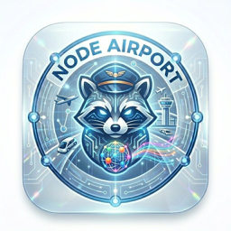

# 快狸机场-遍布全球的高速节点

## 快狸机场介绍

快狸机场是一家基于VLESS协议的企业级IEPL专线机场，致力于为用户提供高速稳定的网络体验。拥有60+优质节点，覆盖香港、台湾、日本、新加坡、美国等热门地区，采用三网优化加速和智能负载均衡分流技术，高峰期依然稳定流畅。全线路支持流媒体解锁和AI工具访问，自研客户端一键连接，多设备同时在线无压力。

## 快狸核心特点

- VLESS协议支持，企业级IEPL专线接入
- 三网优化加速，智能负载均衡分流
- 全线路支持流媒体解锁：Netflix / Disney / HBO / YouTube 等，支持4K流畅播放
- 全线路支持AI工具：ChatGPT / Gemini / TikTok 全球环境
- 60+优质节点，覆盖港/台/新/日/美等地区，计划拓展韩/泰/英/德/法等地区
- 自研客户端，一键连接，多设备同时在线
- 支持iOS / Mac / Android / Windows / Linux（即将上线）

## 快狸订阅套餐

### 月付小套餐

- 价格：¥15.00/月
- 每月50GB高速流量
- 不限速，不限制设备数量
- 解锁各大流媒体及AI工具
- 自研客户端一键使用
- 60+顶级专线节点覆盖

### 年付小套餐

- 价格：¥120.00/年（年付专享）
- 每月30GB流量额度
- 日常轻度使用，浏览/视频/社交轻松覆盖
- 全程不限速，稳定基础线路支持
- 支持主流流媒体平台访问
- 多地区节点覆盖

### 基础版

- 价格：¥22.00/月
- 月付/季度/半年/一年/两年/三年可选
- 每月100GB高速流量
- 全节点高速不限速，多设备同时在线
- 全面支持流媒体平台与主流AI服务访问
- 60+全球优质节点覆盖

### 标准版

- 价格：¥35.00/月
- 月付/季度/半年/一年/两年/三年可选
- 每月250GB高速流量
- 全程不限速，多设备同时连接无压力
- 全面支持主流流媒体与AI应用访问
- 覆盖全球60+节点

### 强化版

- 价格：¥95.00/月
- 月付/季度/半年/一年/两年/三年可选
- 每月500GB高速流量
- 全线路不限速，支持多终端同时在线
- 稳定访问主流流媒体平台及各类AI服务
- 部署60+全球节点，三年折扣约26%

### 顶配版

- 价格：¥180.00/月
- 月付/季度/半年/一年/两年/三年可选
- 每月1000GB高速流量
- 全节点高速不限速，多设备同时在线
- 全面支持流媒体平台与主流AI服务访问
- 60+全球优质节点覆盖

## 快狸用户评价

快狸机场自开业以来，凭借稳定的线路质量和优质的服务体验获得了用户的广泛好评。用户普遍反馈其IEPL专线在高峰期依然保持稳定，4K视频流畅播放，且自研客户端使用便捷，适合对网络稳定性和流媒体解锁有较高要求的用户。

## 快狸常见问题

**问：快狸机场支持哪些协议？**

答：快狸机场采用VLESS协议，企业级IEPL专线接入，保障传输速度和稳定性。

**问：支持哪些设备使用？**

答：支持iOS / Mac / Android / Windows 系统，Linux即将上线。目前使用自研客户端一键开启，暂不支持第三方客户端。

**问：流量如何重置？**

答：常规套餐默认每月订单日重置流量，当月未使用完的流量不会累积到下个月。

**问：支持哪些流媒体和AI服务？**

答：全线路支持Netflix、Disney、HBO、YouTube等流媒体平台，以及ChatGPT、Gemini、TikTok等AI工具访问。

## 快狸官网

点击访问[快狸官方](https://tiao.bid/481)网站。
